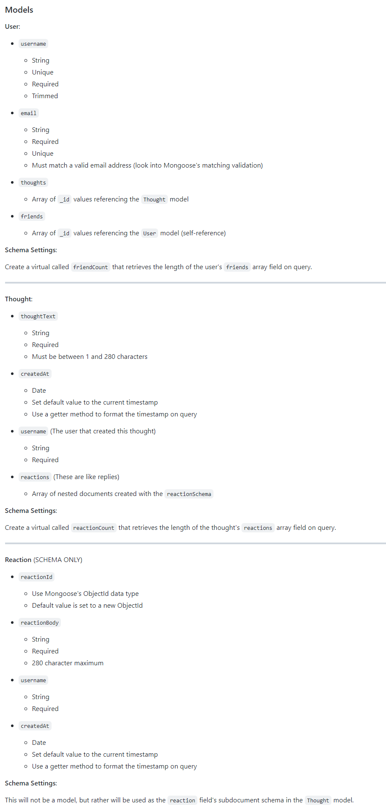
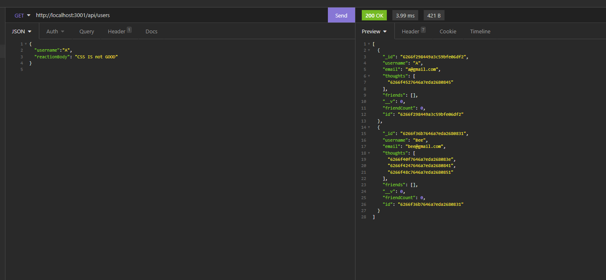

# Social Network API

## Table of Content: 
* [Deploy link](#Deploy-link)
* [Description](#Description)
* [Installation](#Installation)
* [REST](#rest)
* [User Guide](#User-Guide)
* [Third Party Package](#Third-party-package-used)
* [Video Demo](#Video-demo)

## Deploy Link
https://github.com/Aurorachama/api_social_platform

## Description 

This is a api for social media platform for the interaction of database using NoSQL (MongoDB).

## Installation 
### This application requires node.js

***This application relies on node.js as its run-time enviornment. Please install node.js before using this application***

***For information about node.js : [Node.js](https://nodejs.org/)***
* Clone this project using git clone <url> or Download ZIP, then use a command line to  run ``` npm i ``` to install necessary packages
---
<br>
<br>

## REST
**Despite this project is using Express.js, thus somewhat indicates that this is based on a HTTP structure,** <br>
**Although using Web Browser can perform HTTP Get Request, as there are not structured HTML element in this project to perform other request such as POST, DELETE, PUT request (which plays a important part of the project). It is recommended to use some form of REST client. `Insomnia` will be used as the prefered and demostration REST client for this project**

**For information about Insomnia : [Insomnia](https://insomnia.rest/)**

**For information about REST : [REST](https://developer.mozilla.org/en-US/docs/Glossary/REST)**

<br>

---

## User Guide
User then can type 
``` 
node server.js
```
or 
``` 
npm start
```
to run the code. 

* Then, you can access the application by http://localhost:3001 (3001 or other port otherwise specify in .env file)

* Path or Routes includes:
```
/api/users (http://localhost:3001/api/users) for enquiring user related information
  
  /api/users/userId/friends (http://localhost:3001/api/users/userId/friend) for enquiring the user's friend related information matched with the userId

/api/thoughts (http://localhost:3001/api/thoughts) for enquiring thought and reaction related information

```

* Request & Response type for each endpoint

**/api/users**

```
GET request
    Get all the user information (with its assoicated information as response)

GET request by userId (eg: GET: api/users/1d11)
    Get the specific user matched with the userId (with its assoicated information as response)
    (The userid is generated by Mongoose at the point of creating a new user)

POST request
    Creates a new user with the information detailed in the request json

PUT request by userId (eg: PUT: api/users/1d11)
    Updates the specific user matched with the userId with the information detailed in the request json

DELETE request by userId (eg: DELETE: api/users/1d11)
    Delete the specific user matched with the userId
  
```

**/api/users/:userId/friends**
  
  **Keep in mind userId should be valid in order for this route to work** 

```
POST request by friendId (eg: POST: api/users/1d11/friends/2e44)
    User matched with the userId will be updated with a friend parameter matched with the friendId detailed in the request json

DELETE request by friendId (eg: DELETE: api/users/1d11/friends/2e44)
    A friend parameter matched with the friendId will be deleted for the User matched with the userId detailed in the request json
  
```
  
**/api/thoughts**

```
GET request
    Get all the thought information (with its assoicated information as response)

GET request by thoughtId (eg: GET: api/thoughts/1d11)
    Get the specific thought matched with the thoughtId (with its assoicated information as response)
    (The thoughtId is generated by Mongoose at the point of creating a new thought)

POST request
    Creates a new thought with the information detailed in the request json

PUT request by thoughtId (eg: PUT: api/thoughts/1d11)
    Updates the specific thought matched with the thoughtId with the information detailed in the request json

DELETE request by thoughtId (eg: DELETE: api/thoughts/1d11)
    Delete the specific thought matched with the thoughtId
  
```
  
**/api/thoughts/:thoughtId/reactions**
  
  **Keep in mind thoughtId should be valid in order for this route to work** 

```
POST request (eg: POST: api/thoughts/1d11/reactions)
    Reaction detailed in the request json will be added to the thought matched with the thoughtId

DELETE request (eg: DELETE: api/thoughts/1d11/reactions)
    Delete the reactions under the thought matched with the thoughtId
  
```
  
  
* Here is a photo of every coloumn in every set of endpoint for reference to requesting



## Third party Javascript package used
[Express](https://github.com/expressjs/express) <br>
[Mongoose](https://github.com/Automattic/mongoose) <br>
[Date-and-time](https://github.com/knowledgecode/date-and-time) <br>

## Video Demo
[](https://watch.screencastify.com/v/hkzHpuGb6RB14ZaQn2Do)
